<h3><code>prajval@github ~ $ whoami</code></h3>
<table>
  <tr>
    <td valign="top"></td>
    <td valign="top"></td>
  </tr>
</table>

---

  

  

### 🚀 About Me

🌱 &nbsp;I'm currently learning **DevOps and Cybersecurity**  
👯 &nbsp;I'm looking to collaborate on **Web development and open-source projects**  
🤔 &nbsp;I'm looking for help with **System design, deployment and writing scalable applications**  
💬 &nbsp;Ask me about **Java, DSA, Web Development, Git/GitHub &amp; Cybersecurity**  
⚡ &nbsp;Fun fact: **I learn best by building things and breaking them until I understand how they work.**

### 🛠️ Tech Stack

  
  
  
  
  
  
  
  
  
  
  
  
  
  
  
  

### 🔰 My Projects 
# 🎓 CampusConnect

A full-stack college club & event management platform connecting **students, club heads, and faculty/admins** through one centralized system.

## 💻 Tech Stack
**Next.js** • **Java Spring Boot** • **PostgreSQL**

## ✨ Features
- 👨‍🎓 **Students:** Event registration, volunteering, club directory, notifications & approved account access
- 🏛️ **Club Heads:** Club management, event CRUD, participant & volunteer tracking
- 👨‍🏫 **Faculty/Admin:** User management, event approvals, dashboards & analytics

## 🏗️ Architecture
**Next.js → Spring Boot REST API → PostgreSQL**

## 👥 Team
Vedant Garje • **Prajval Chavare** • Rohan • swara

## 🔗 Live Project

[🚀 View CampusConnect](https://campus-frontend-six.vercel.app/)

------------------------------------------------------------------------------------------------------------------------------------------------------------------
### 🔗 Connect With Me

  
  
  
  

### 📊 GitHub Stats

  
  

### 📈 Contribution Graph

  

---

<i>⭐️ From <a href="https://github.com/prajvxl">prajvxl</a></i>

